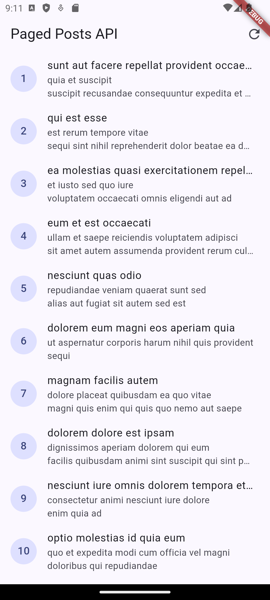
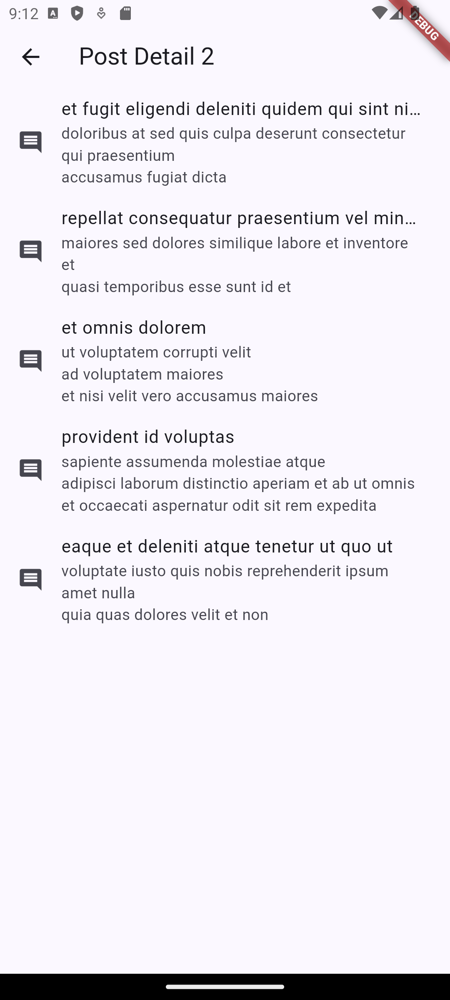
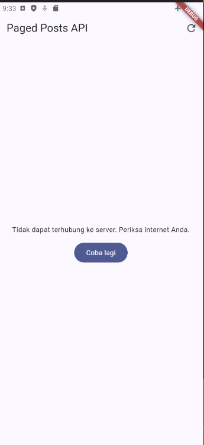

# Laporan Modul 04 — Networking & REST API

Repositori ini mendokumentasikan pengerjaan modul praktikum ke-4, mencakup implementasi komunikasi dengan REST API menggunakan **Dio**, manajemen state asinkron menggunakan **Riverpod**, serta navigasi antar halaman menggunakan **GoRouter**.

---

## 👤 Informasi Mahasiswa
* **Nama Lengkap:** Muhammad Fatahillah Athabrani
* **NIM:** 244107020121
* **Program Studi:** D4 Teknik Informatika
* **Kelas:** TI 3F
* **Mata Kuliah:** Pemrograman Mobile 

---

## 📌 Peta Pembahasan
1. [Ikhtisar Pembelajaran](#1-ikhtisar-pembelajaran)
2. [Hierarki Direktori Proyek](#2-hierarki-direktori-proyek)
3. [Tugas Utama — REST API dengan Dio & Riverpod](#3-tugas-utama--rest-api-dengan-dio--riverpod)
4. [AI Challenge & Verification Checklist](#4-ai-challenge--verification-checklist)
5. [Refleksi](#5-refleksi)
6. [Pengujian Otomatis (Testing)](#6-pengujian-otomatis-testing)
7. [Dokumentasi Visual (Screenshot)](#7-dokumentasi-visual-screenshot)
8. [Instruksi Menjalankan Aplikasi](#8-instruksi-menjalankan-aplikasi)
9. [Rangkuman Akhir](#9-rangkuman-akhir)

---

## 1. Ikhtisar Pembelajaran
Pada praktikum ini, dipelajari secara mendalam bagaimana mengintegrasikan aplikasi Flutter dengan layanan backend via REST API:
* Penggunaan **Dio** untuk melakukan request HTTP dengan fitur interseptor dan manajemen konfigurasi yang terpusat.
* Pembuatan **Repository Pattern** untuk memisahkan logika pemanggilan API dari lapisan UI maupun state management.
* Pemanfaatan **AsyncNotifier** dan **FutureProvider.family** pada Riverpod v3 untuk memproses state data asinkron (*loading*, *error*, dan *data*) serta fungsionalitas seperti *pull-to-refresh* dan *infinite scroll*.
* Integrasi **GoRouter** untuk mendukung navigasi *deep linking* ke halaman detail yang mengambil argumen ID dari parameter URL.

---

## 2. Hierarki Direktori Proyek
```text
_04_week_4_networking_rest_api/
├── README.md                               <- Laporan komprehensif praktikum & tugas
├── Screenshot/                             <- Dokumentasi visual eksekusi aplikasi
├── lib/
│   ├── main.dart                           <- Entry point dan konfigurasi GoRouter
│   ├── data/
│   │   ├── api_client.dart                 <- Konfigurasi Dio 
│   │   ├── network_errors.dart             <- Utilitas penanganan pesan error jaringan
│   │   ├── paged_posts_provider.dart       <- Provider dan state untuk Infinite Scroll
│   │   ├── providers.dart                  <- Kumpulan provider utama
│   │   ├── models/
│   │   │   ├── comment.dart                <- Model data Komentar (Tugas AI)
│   │   │   └── post.dart                   <- Model data Post
│   │   └── repositories/
│   │       ├── comment_repository.dart     <- Lapisan data Komentar
│   │       └── post_repository.dart        <- Lapisan data Post
│   ├── pages/
│   │   ├── paged_post_page.dart            <- Halaman daftar Post dengan Infinite Scroll
│   │   ├── post_detail_page.dart           <- Halaman detail Post dan daftar Komentar
│   │   └── post_list_page.dart             <- Halaman daftar Post awal
│   └── widgets/
│       └── post_tile.dart                  <- Komponen UI terpisah untuk baris Post
└── test/
    ├── comment_test.dart                   <- Unit test untuk model Comment
    ├── post_repository_test.dart           <- Unit test (mock) untuk PostRepository
    └── widget_test.dart                    <- Smoke test aplikasi
```

---

## 3. Tugas Utama — REST API dengan Dio & Riverpod

Aplikasi ini mendemonstrasikan implementasi klien REST API yang tangguh dengan spesifikasi fungsional:
1. **Daftar Post**: Mengambil daftar post dari `JSONPlaceholder` dan menampilkannya dalam bentuk daftar (ListView).
2. **Infinite Scroll**: Mendukung penarikan data secara bertahap berbasis halaman (*pagination*) saat pengguna men-scroll hingga ke ujung bawah halaman.
3. **Error Handling Terpusat**: Memetakan exception teknis dari Dio (contoh: tidak ada internet, 404, 500, timeout) menjadi pesan error yang ramah pengguna, lengkap dengan fitur *Retry*.

---

## 4. AI Challenge & Verification Checklist

Sebagai bagian dari tantangan AI, saya meminta AI untuk menambahkan entitas Komentar (Comment) yang terkait dengan setiap Post.

**Prompt yang Digunakan:**
> "Tolong buatkan model data `Comment` dari JSONPlaceholder endpoint `/comments` dengan penanganan field null yang aman, kemudian buat `CommentRepository` dengan timeout 10 detik. Terakhir buat provider untuk mengambil komentar berdasarkan `postId` dan menangani error API seperti 404, 500."

**Hasil Verifikasi:**
- [x] **Model Null-Safe**: Ya, class `Comment` telah dilengkapi parser `fromJson` yang dapat mengatasi nilai `null` dengan me-return fallback (misal `''` atau `0`).
- [x] **Repository dengan Override Timeout**: Ya, `CommentRepository` melakukan request ke `/comments?postId=...` dengan me-override properti `options` di Dio untuk meng-enforce timeout `10000 ms`.
- [x] **Penyediaan State Berbasis Argumen**: Ya, saya menggunakan `FutureProvider.family<List<Comment>, int>` (versi Riverpod 3) untuk mempermudah passing argumen `postId` dan langsung merender state via ekstensi `.when()`.
- [x] **Integrasi UI**: Data diikat pada `PostDetailPage` dan men-support tombol *Retry* (`ref.invalidate()`) jika gagal termuat.
- [x] **Lolos Pengujian**: Unit test terhadap error handling berjalan dengan sukses.

---

## 5. Refleksi

**1. Mengapa memisahkan logika HTTP (Dio) ke dalam layer `Repository` daripada langsung di dalam Provider?**
Pemisahan ke layer `Repository` sangat krusial untuk memenuhi kaidah *Single Responsibility Principle*. Layer ini bertugas mengatur payload, URL endpoint, dan header, sehingga file provider hanya berfokus pada logika *state management*. Dengan arsitektur ini, `Repository` dapat dengan mudah di-*mock* untuk unit testing tanpa harus mensimulasikan koneksi internet yang nyata.

**2. Bagaimana strategi penanganan *null safety* pada model serialisasi REST API?**
Data yang turun dari REST API tidak selalu sempurna (bisa saja *missing field* atau bernilai *null* tanpa disengaja oleh server). Model yang baik harus menggunakan `??` (fallback) atau *conditional casting* (seperti `(json['id'] as num?)?.toInt() ?? 0`) saat mengurai data JSON untuk menghindari aplikasi *crash* akibat *NullPointerException*.

**3. Apa keuntungan menggunakan `FutureProvider.family` atau `FamilyAsyncNotifier`?**
Keduanya memungkinkan kita memiliki *state asinkron yang independen* namun dapat dibuat berdasarkan parameter spesifik (seperti ID produk atau ID post). Hal ini menghindarkan kita dari penggunaan satu state global besar yang menampung terlalu banyak detail; sebaliknya setiap parameter akan membuat instance state *cache* yang dikelola memorinya secara dinamis (di-*dispose* bila tak lagi dipantau).

---

## 6. Pengujian Otomatis (Testing)

Pengujian telah diintegrasikan menggunakan *mocktail* dan paket testing bawaan Flutter. Tujuannya adalah memvalidasi keamanan serialisasi JSON dan logika repository tanpa mengirim *request* HTTP sungguhan.

### Hasil Eksekusi `flutter test`:
```text
00:00 +0: loading D:/SEMESTER 5/MOBILE/244107020121-mobile-course/_04_week_4_networking_rest_api/test/comment_test.dart
00:00 +0: Comment Model Test fromJson handles null values and missing fields safely
00:00 +1: D:/SEMESTER 5/MOBILE/244107020121-mobile-course/_04_week_4_networking_rest_api/test/post_repository_test.dart: PostRepository fetchPosts returns list of posts on success
00:01 +2: D:/SEMESTER 5/MOBILE/244107020121-mobile-course/_04_week_4_networking_rest_api/test/widget_test.dart: App smoke test
00:03 +3: All tests passed!
```

---

## 7. Dokumentasi Visual (Screenshot)

### Praktikum & Halaman Awal
Berhasil memuat 10 data pertama menggunakan API JSONPlaceholder.


### Infinite Scroll
Aplikasi memuat data halaman selanjutnya secara dinamis ketika melakukan *scroll* mendekati dasar daftar post.


### Detail Page (AI Challenge)
Klik salah satu list item akan membuka navigasi baru menggunakan `GoRouter` dan memuat daftar komentar berdasarkan parameter URL `postId`.


### Error State 
Jika koneksi internet dimatikan (*Airplane Mode*), aplikasi menyajikan pesan error yang ramah pengguna beserta tombol "Coba lagi".


---

## 8. Instruksi Menjalankan Aplikasi

```bash
# 1. Pindah ke direktori utama tugas
cd _04_week_4_networking_rest_api

# 2. Ambil seluruh dependensi
flutter pub get

# 3. Jalankan aplikasi (pilih emulator / device Anda)
flutter run

# 4. Jalankan analisis kelayakan dan test
flutter analyze
flutter test
```

---

## 9. Rangkuman Akhir

* [x] **Analisis Bebas Error:** `flutter analyze` tervalidasi 0 error & 0 warning.
* [x] **Pengujian Berhasil:** Seluruh skenario pada `flutter test` lulus 100% (termasuk *mock test* repository).
* [x] **Arsitektur Rapi:** Memisahkan *Client*, *Repository*, *Provider*, dan *UI*.
* [x] **Pengelolaan API Kuat:** Fitur *Timeout*, pencegahan field JSON null, serta penerjemahan Exception ramah pengguna berfungsi sempurna.
* [x] **Infinite Scroll Berjalan:** Pagination berhasil diimplementasikan tanpa menggunakan *package* eksternal tambahan selain Riverpod.
* [x] **Dokumentasi Terstruktur:** Laporan di `README.md` merangkum semua spesifikasi tugas dengan rapi, senada dengan laporan-laporan sebelumnya.
